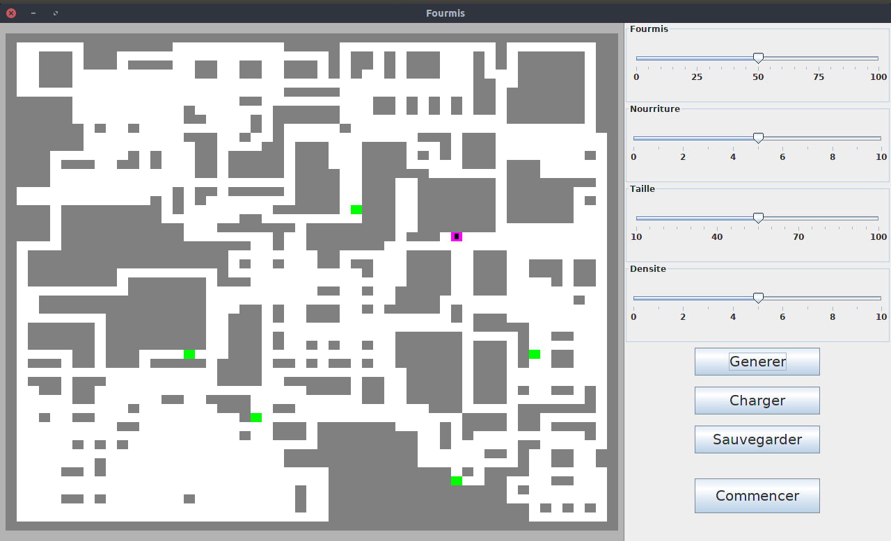

# Projet-PI4

> Ant Colony Optimisation

---
## Fonctionnalitées

Ce projet consite en une application qui vous permet de générer des labyrinthes, dans lequel des fourmis se chargent de trouver le chemin le plus court entre leur colonie et des sources de nourritures.

La façon dont les fourmis trouvent la nourriture se base sur un algorithme ACO ( _ant colony optimisation_ ).


## Execution & Installation

Pour faire tourner le code du projet, il convient d'avoir Java 8+ et d'utiliser Linux. Les autres systèmes d'éxecution, surtout les systèmes privateurs et non-libres, ne sont pas pris en compte.

Si vous ne l'êtes pas déjà, placez-vous dans la branche master. Si vous ne faite que télécharger le code dans un .zip, vous n'avez rien d'autre à faire.

Ensuite, il suffit de faire tourner `run.sh` avec `./run.sh`.

## Screenshots

> L'écran de génération affiché au lancement du logiciel. Il vous permet de choisir le nombre de fourmis, de nourriture, la taille du labyrinthe, et la densité du labyrinthe. Plus il sera dense, moins il y aura d'espace vide.

Avant de lancer la simulation, il convient de générer un terrain. Vous pouvez aussi continuer une simulation passé, ou sauvegarder un terrain qui vous parait intéressant.



> L'écran de simulation, où vous pouvez modifier la simulation en cours de route en rajoutant de la nourriture, modifier les obstacles, ou rajouter de l'eau. Vous pouvez aussi ajuster la vitesse de le simulation. Si une simulation vous paraît intéressante, vous pouvez la sauvegarder.


## Licence

```
Copyright (C) 2019 Nasser, Lucie, Felipe et Nelson

This program is free software: you can redistribute it and/or modify it under the terms of the GNU General Public License as published by the Free Software Foundation, either version 3 of the License, or (at your option) any later version.

This program is distributed in the hope that it will be useful, but WITHOUT ANY WARRANTY; without even the implied warranty of MERCHANTABILITY or FITNESS FOR A PARTICULAR PURPOSE. See the GNU General Public License for more details.

You should have received a copy of the GNU General Public License along with this program. If not, see <http://www.gnu.org/licenses/>.

```
